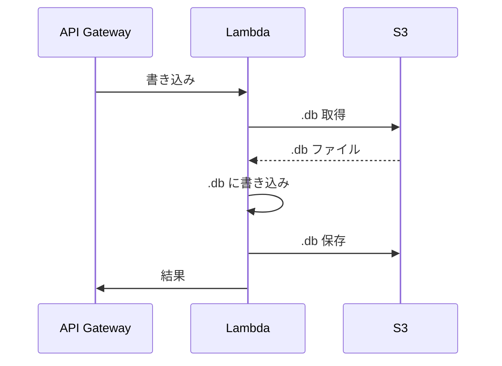
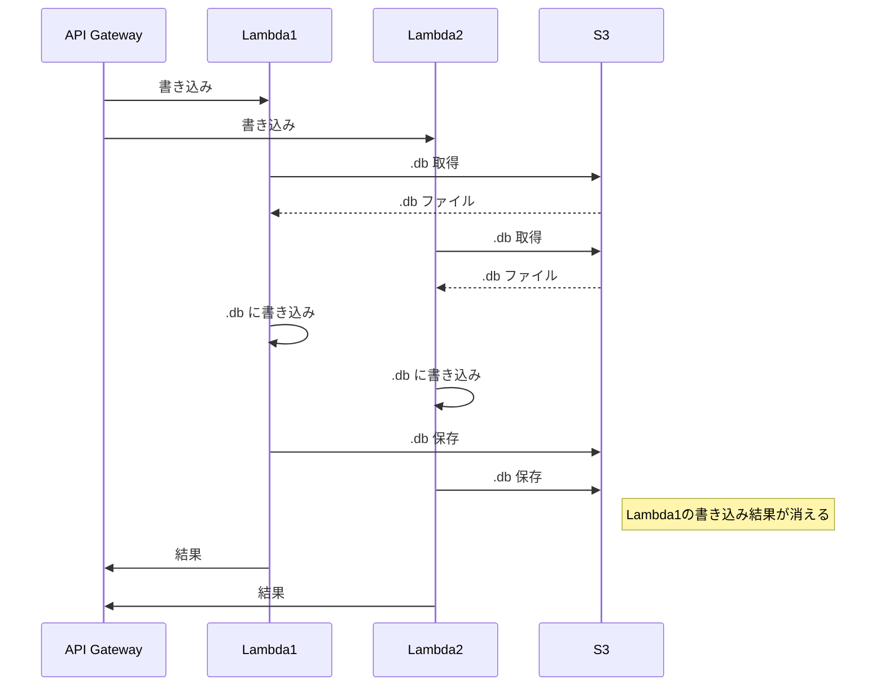
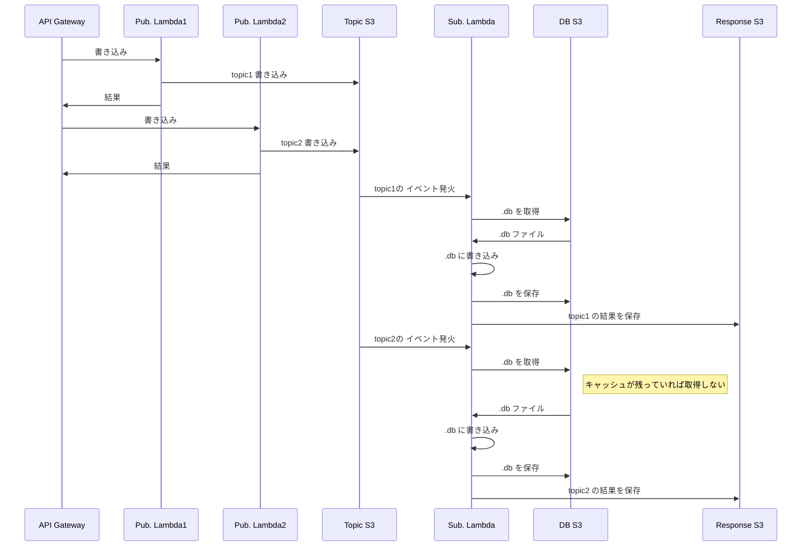
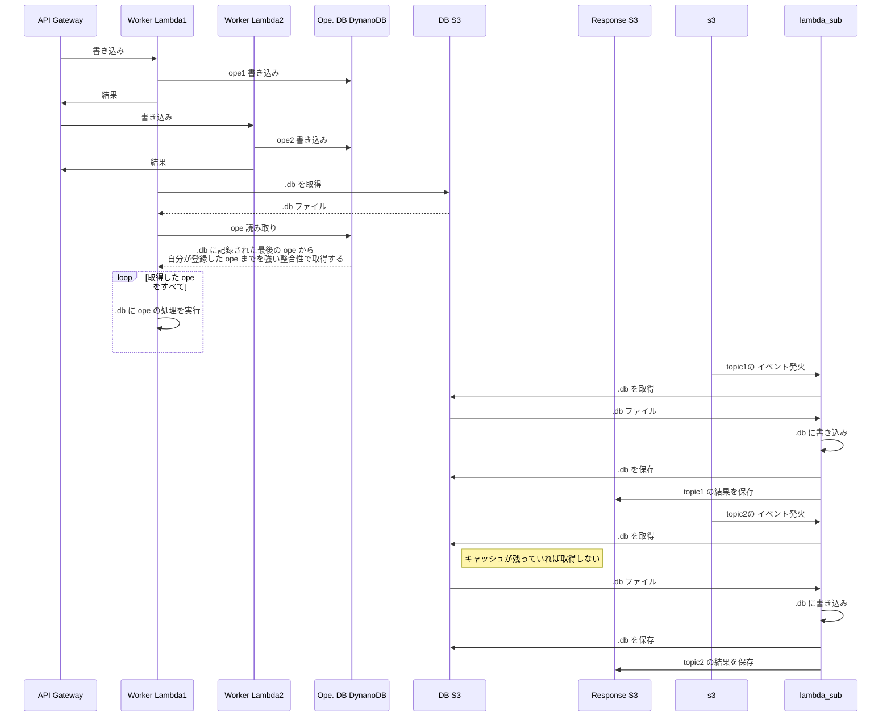
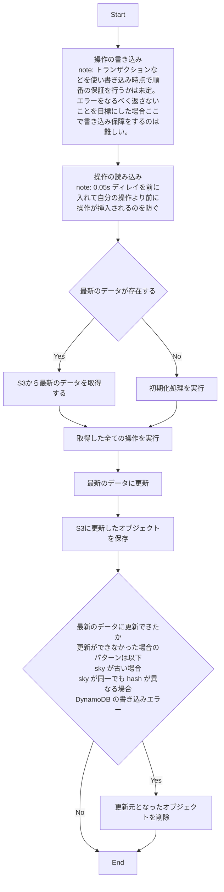
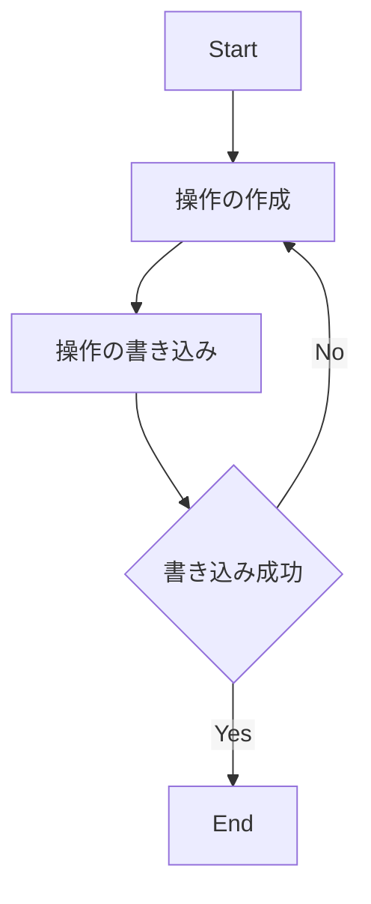
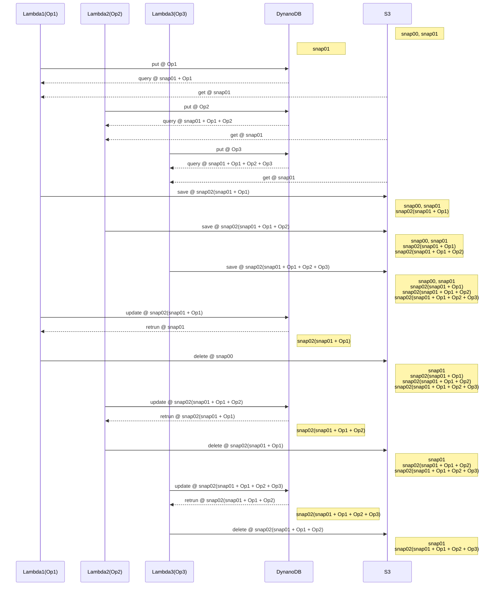
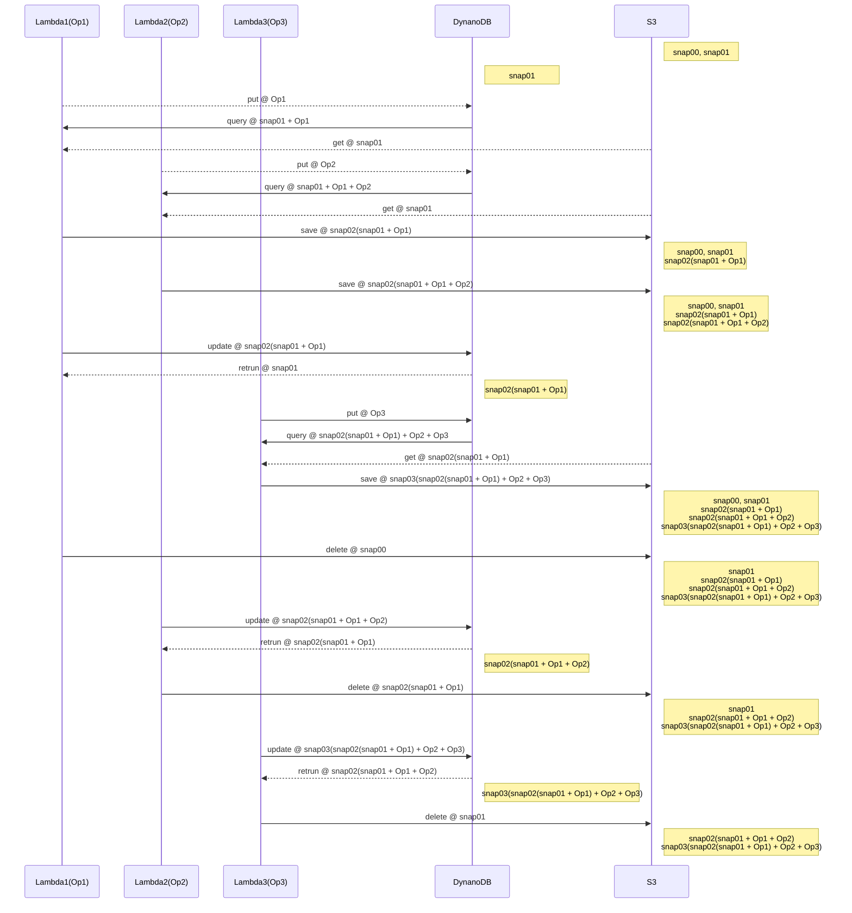

## SQLite をシンプルに S3 に保存

API Gateway からのリクエストが必ず 1 つだけであれば以下のようなシーケンスで問題なく SQLite を使える



ただし、2 つ以上のリクエストが入ると DB への書き込みが上書きされてしまう場合が存在するので通常利用は不可



## S3 を Pub/Sub の Topic に利用して非同期

Sub. Lambda は同時実行数を 1 に設定しておく。  
S3 のイベントで Sub. Lambda を発火するときに複数のイベントが発火するときスロットリングが発生するが、S3 の場合はリトライをしてくれるのでイベントが落ちることはない様子。
ただし、10 topic で試してみたところすべての topic を処理するのに 30s ～ 2m 程かかったので実用性はあまりない。



## DynamoDB をオペレーションのキューとして扱う



## DynamoDB の役割

- 操作のキューイング
  - 操作の追加
  - どこまでの操作を実行したかの管理
- S3 の削除管理

### 操作のキューイング

対象のオブジェクトに対してのパラレルな操作をキューイングしてシーケンシャルな操作に変換する。

#### キューイングされるオペレーション

| 列  | partition | sort | type    | 説明                                       | フォーマット                    |
| --- | --------- | ---- | ------- | ------------------------------------------ | ------------------------------- |
| cky | o         |      | string  | 操作対象のオブジェクトを判別するためのキー | `${system_name}:${object_path}` |
| sky |           | o    | string  | 作成日時順にソート可能なユニークなキー     | `OP:a0:${ulid}`                 |
| exp |           |      | numeric | TTL(現在時間 + 60s)                        | 整数                            |
| ver |           |      | numeric | フォーマットバージョン                     | 1                               |
| ope |           |      | string  | 操作内容                                   | JSON                            |

exp の計算

```python
import time
ttl = int(time.time()) + 60
```

```javascript
const now = new Date();
const ttl = Math.floor(new Date(now.getTime() + 60000).getTime() / 1000);
```

`ope` の構造

```typescript
interface OpeSqliteV1 {
  _type: "sqlite";
  ver: "1";
  sqls: string[];
}

type Ope = OpeSqliteV1;
```

#### 書き込まれた最新の操作

| 列  | partition | sort | type    | 説明                                       | フォーマット                    |
| --- | --------- | ---- | ------- | ------------------------------------------ | ------------------------------- |
| cky | o         |      | string  | 操作対象のオブジェクトを判別するためのキー | `${system_name}:${object_path}` |
| sky |           | o    | string  | 作成日時順にソート可能なユニークなキー     | `OP:Z0:`                        |
| ver |           |      | numeric | フォーマットバージョン                     | 1                               |
| lsk |           |      | string  | 操作の中で最も大きい sky                   | `${ulid}`                       |

#### 操作の結果

| 列        | partition | sort | type    | 説明                                                | フォーマット                                 |
| --------- | --------- | ---- | ------- | --------------------------------------------------- | -------------------------------------------- |
| cky       | o         |      | string  | 操作対象のオブジェクトを判別するためのキー          | `${system_name}:${object_path}`              |
| sky       |           | o    | string  | 作成日時順にソート可能なユニークなキー              | `OP:c0:${sky}`                                     |
| ver       |           |      | numeric | フォーマットバージョン                              | 1                                            |
| res       |           |      | map     | 操作の結果データ, key: sky                          | map                                          |
| res[].ste |           |      | numeric | 結果のステータスコード 0が正常                      | 整数                                         |
| res[].typ |           |      | string  | 結果のデータタイプ                                  | `json` or `s3`                               |
| res[].dat |           |      | string  | 結果のデータ タイプによって保存される内容が変化する | 結果のデータが存在する場合は文字列で保存する |

#### 最新の実行

| 列  | partition | sort | type     | 説明                                                   | フォーマット                    |
| --- | --------- | ---- | -------- | ------------------------------------------------------ | ------------------------------- |
| cky | o         |      | string   | 操作対象のオブジェクトを判別するためのキー             | `${system_name}:${object_path}` |
| sky |           | o    | string   | 固定値                                                 | `OP:b0:`                        |
| ver |           |      | numeric  | フォーマットバージョン                                 | 1                               |
| cur |           |      | string   | 最新のオペレーションの skey                            | `${ulid}`                       |
| prv |           |      | string[] | 更新前の cur のリスト                                  | `${ulid}`                       |
| has |           |      | string   | 操作の連続性が保証されることを確かめるためのハッシュ値 | `${ulid}`                       |

`has` の計算

以下のような計算を行う

```python
import zlib
from functools import reduce

prev_has = "00000000"

ope_sky_list = [
    "01HWTMXQ3Q6BDR6TXA12GEYD5S"
    , "01HWTMY29K78V1S8M12GJ8C26C"
]

next_has = reduce(lambda prev, val: hex(zlib.crc32((prev + val).encode("ascii")))[2:],ope_sky_list, prev_has)

```

### S3 の削除管理

不要になったオブジェクトの削除に失敗したときに後でそのオブジェクトを削除できるように記録する。

| 列  | partition | sort | type    | 説明                                       | フォーマット                    |
| --- | --------- | ---- | ------- | ------------------------------------------ | ------------------------------- |
| cky | o         |      | string  | 操作対象のオブジェクトを判別するためのキー | `${system_name}:${object_path}` |
| sky |           | o    | string  | 作成日時順にソート可能なユニークなキー     | `DE:${ulid}`                    |
| ver |           |      | numeric | フォーマットバージョン                     | 1                               |
| sts |           |      | string  | ステータスコード                           | 文字列                          |
| err |           |      | string  | エラー内容                                 | 文字列                          |

## 操作の適用フローチャート



オブジェクトの削除をするため、別のリクエストでオブジェクトの読み込み時にエラーが発生する可能性がある  
それをどう保証するか？

sky と hash の両方が異なる場合、そのリクエストで実施した操作が全て正しいかわからない

## 操作の書き込み



書き込みでは sky が最新の値より大きい値でなければ保存できないようにトランザクションを使用して実行する

snap01
OpeA
OpeB -> snap01.snap02(B)
OpeC
OpeD -> snap01.snap02(D)
OpeE -> snap02(B).snap03(E)

UpdateItem を使用した場合、ALL_OLD で更新前の値を取得することができる。
そのため OpeB の snap02 書き込み後 OpeD の snap02 を書き込んだ場合、 OpeB の snap02 を取得することが可能。
そのデータを使い、prev が同一の場合 OpeB の snap02 は削除を行う。

### 同じスナップショットを取得して操作を適用した場合



### Op3 が snap02(Ope1) を取得した場合



これは snap02(snap01 + Op1 + Op2) が削除できなくなっている？
