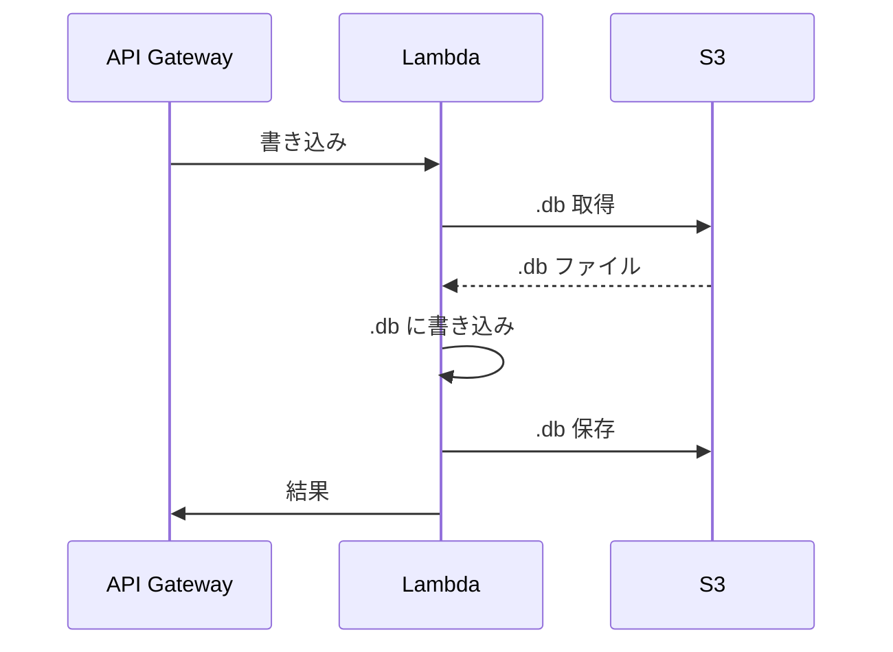
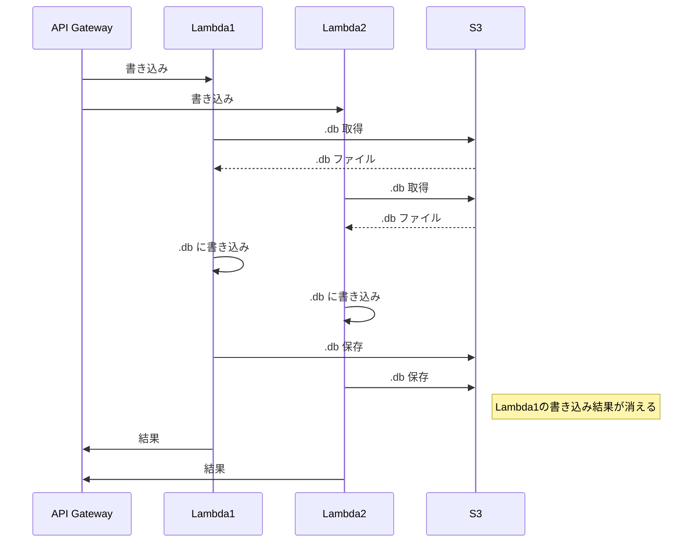
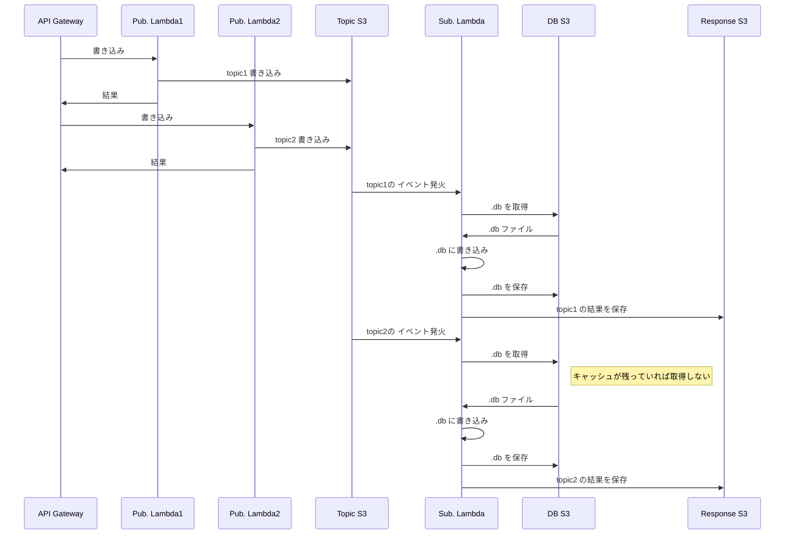
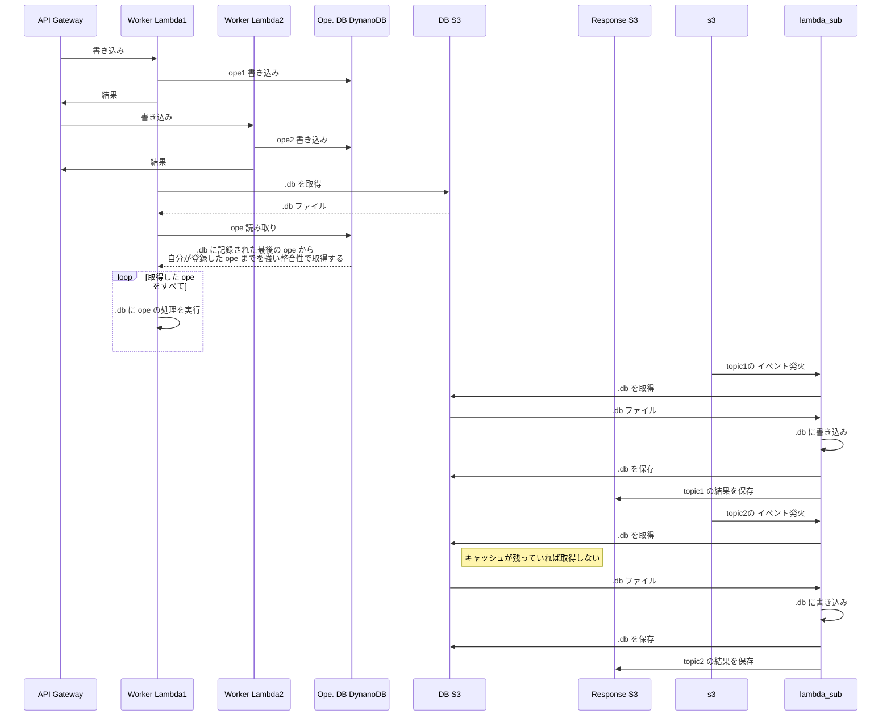

## SQLite をシンプルに S3 に保存

API Gateway からのリクエストが必ず 1 つだけであれば以下のようなシーケンスで問題なく SQLite を使える

ただし、2 つ以上のリクエストが入ると DB への書き込みが上書きされてしまう場合が存在するので通常利用は不可

## S3 を Pub/Sub の Topic に利用して非同期

Sub. Lambda は同時実行数を 1 に設定しておく。  
S3 のイベントで Sub. Lambda を発火するときに複数のイベントが発火するときスロットリングが発生するが、S3 の場合はリトライをしてくれるのでイベントが落ちることはない様子。
ただし、10 topic で試してみたところすべての topic を処理するのに 30s ～ 2m 程かかったので実用性はあまりない。

## DynamoDB をオペレーションのキューとして扱う

